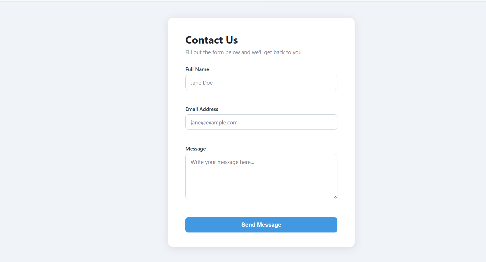
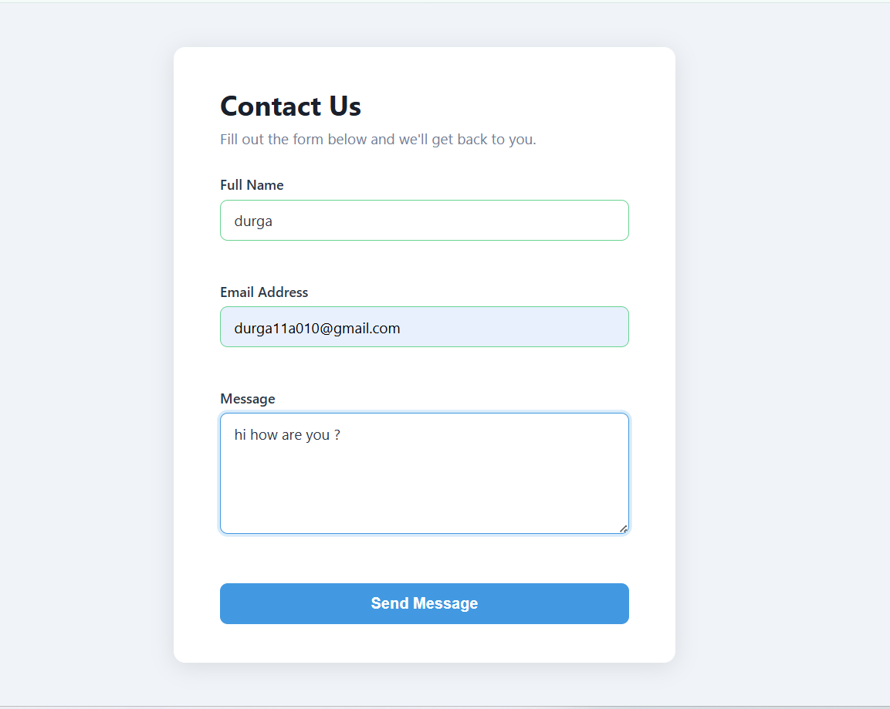
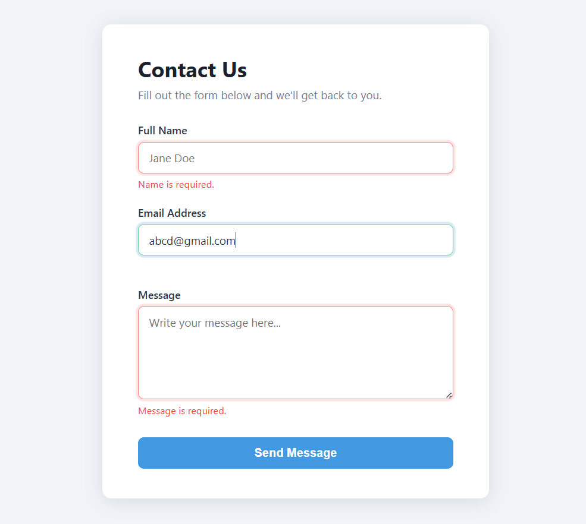
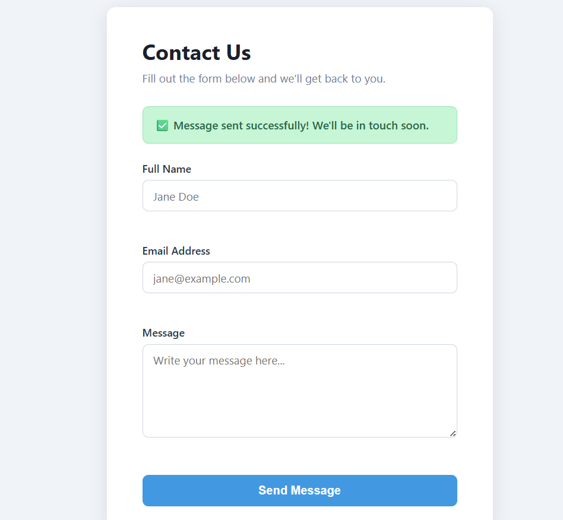

📬 Contact Form with JavaScript Validation

A responsive and user-friendly contact form built using HTML, CSS, and vanilla JavaScript, featuring real-time client-side validation and interactive feedback.

**🚀 Features**
✅ Form validation for Name, Email, and Message
💬 Inline error messages for each field
✍️ Real-time validation while typing (after first interaction)
🔍 Validation on field blur (when user leaves input)
📧 Email format validation using Regex
🚫 Prevents submission if inputs are invalid
🎉 Success message displayed on valid submission
⏱️ Auto-hide success banner after 5 seconds
🔄 Form resets after successful submission
**📂 Project Structure**
contact-form/
│── index.html      # Structure of the form
│── style.css       # Styling and validation UI
│── validate.js     # JavaScript validation logic
│── README.md       # Project documentation
**🧪 Validation Rules**
Field	Requirements
Name	Required, minimum 2 characters
Email	Required, valid email format
Message	Required, minimum 10 characters
**⚙️ How to Run
**
No installation required. Simply open the project in a browser:

Option 1:
Open index.html directly in your browser
Option 2 (Recommended):

Use VS Code Live Server:

Right-click on index.html
Select "Open with Live Server"

🛡️ Edge Cases Handled
Empty input fields
Whitespace-only input (trimmed before validation)
Invalid email formats (e.g. user@, @domain.com)
Inputs shorter than required length
Special characters allowed in Name and Message

📧 Email Validation Regex
/^[^\s@]+@[^\s@]+\.[^\s@]{2,}$/

✔️ Supports formats like:

user@domain.com
user.name@domain.org
user+tag@sub.domain.co

## 📸 Screenshots

### 📝 Form Page

### ⚠️ Validation Demo

### 🚫 Edge Cases

### ✅ Successful Submission

